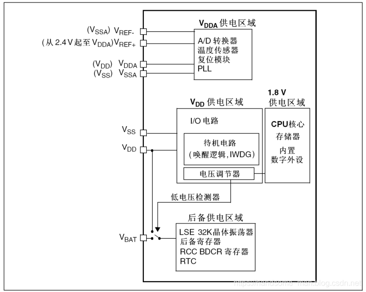
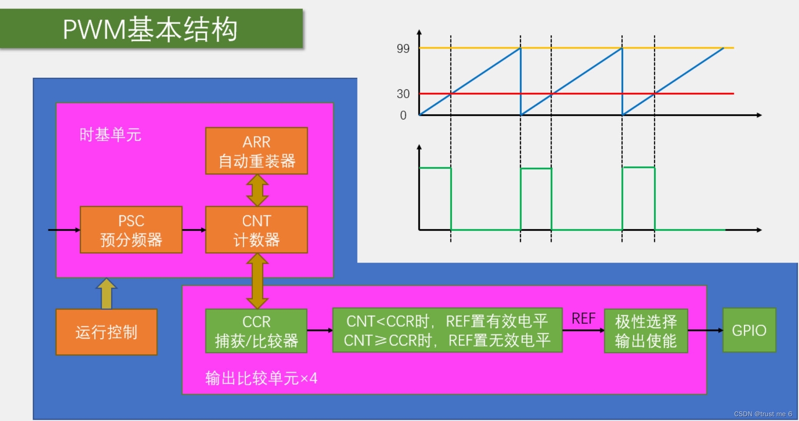
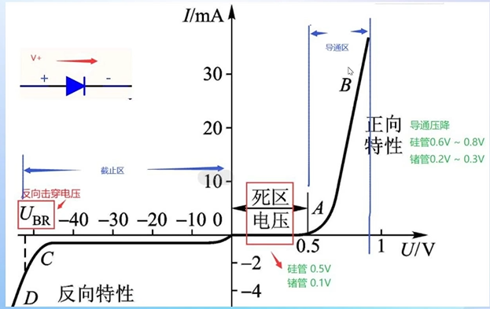
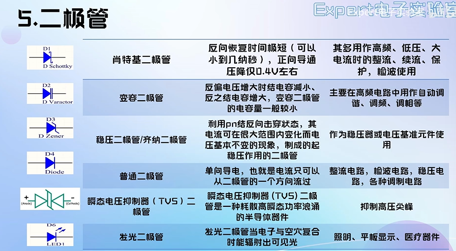
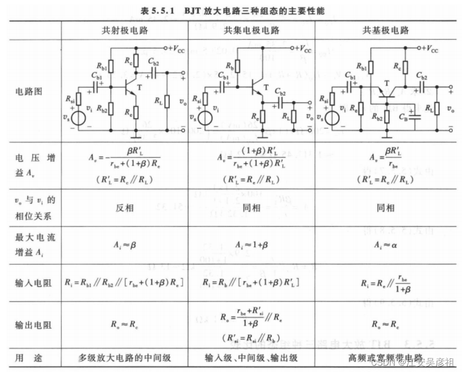
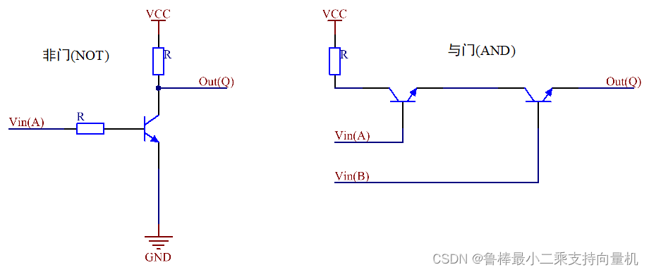
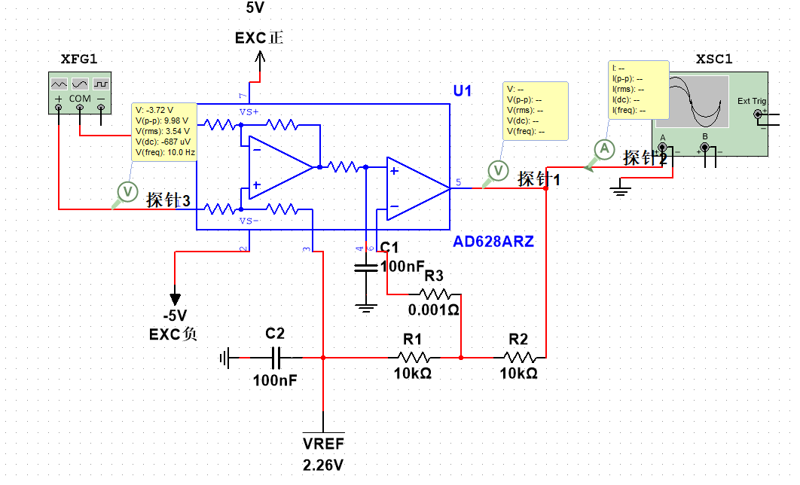

# 一、嵌入式开发
## stm32单片机
### 常见引脚
#### 电源管理!
    
1. VCC：供电高电压
2. GND：地
3. VDD：芯片工作高电平电压
4. VSS：芯片工作低电平电压
5. VUSB：USB电源电压
6. VIO：IO电源电压
7. VBAT：电池电压，不加电池要接在VDD上
8. VSYS：系统电压
9. VDDA：模拟电压高压
10. VSSA：模拟电压低压
11. VDDQ：高频电压
12. VSSQ：低频电压
13. VREF+：参考电压正极
14. VREF-：参考电压负极
15. VDDD：数字电压高压
16. VSSS：数字电压低压
17. VEE：负电压

#### 初始化引脚
1. RESET：复位引脚，低电平复位
2. NRST：内部复位引脚，低电平复位
3. BOOT0：启动模式选择引脚，低电平进入下载模式，高电平进入用户模式
4. NMI：非mask中断引脚，低电平触发中断

### 时钟系统
### 启动过程
### 通用通讯协议
1. GPIO：通用输入输出（**用电平转换电路提高IO口电流输出能力**）
   * `` HAL_GPIO_ReadPin(GPIOA,GPIO_PIN_4);//读取PA4引脚状态``
	  ``HAL_GPIO_WritePin(GPIOA,GPIO_PIN_4,GPIO_PIN_SET/GPIO_PIN_RESET);//设置PA4引脚为高/低电平``
2. USART（UART）：串口通讯协议
   * 异步（Asynchronous）不用接受反馈就可以继续发送数据，适合短距离通信，速度快，但数据量有限。//比特率相等，起始位、停止位、校验位相同
   * 同步(Synchronous)需要接受反馈才能发送下一位数据，适合长距离通信，速度慢，但数据量大。
3. PWM：（Pulse Width Modulation）脉冲宽度调制!
   * 通过改变占空比来控制输出电压的变化，来达到不同频率的控制信号。
   * f(PWM)=时钟脉冲/(PSC(预分频器)+1)/(ARR(自动重装值)+1)  计数器可以向上或向下计数，ARR为计数器的最大值。
   * compare值为逻辑高低电平分界线。占空比（低电平占比）=compare/ARR。
   * 舵机控制（180度），以20ms为周期，高电平时间在0.5ms-2.5ms之间，为从0到180度角度模式。
   * RGB灯珠控制（ws2812b，dam+pwm）
      1. pwm设置为周期为1.25us，compare为1/3arr时为低电平，2/3arr为高电平
      2. 每个灯珠为24位16位数据控制，前八为绿灯，中间为红，后八为蓝，需要80us以上低电平复位
      3. cubemx设置dam数据传输方向为内存到外设
      4. ``  HAL_TIM_PWM_Start_DMA(&htim1, TIM_CHANNEL_1, (uint32_t *)Pixel_Buf,(Pixel_NUM+1)*24);  //DMA数据传输开启``
  
  
3. I2C：两线式串行通讯协议
4. I2S：数字音频串行接口
5. SPI：四线式串行通讯协议
6. CAN：控制器局域网协议
7. USB：通用串行总线协议
8. RS485：半双工串行通讯协议
9.  RS232：串行通讯协议
10. Ethernet：以太网协议
11. ADC：模拟到数字转换器
12. DAC：数字到模拟转换器
13. SWD：单板调试接口
14. JTAG：调试接口

### system code
1. CORTEX-M系列：ARM处理器
2. DMA：直接存储器存取，适合较大数据的高速传输
3. NVIC：中断向量控制器
4. WDG：看门狗
5. RCC：时钟控制器
6. SYS：系统控制
7. freeRTOS：实时操作系统

### 外设驱动开发
#### TFT显示屏
1. 接口：SPI接口（MOSI MISO SCK CS） vcc-3.3v BACKLIGHT-PWM GND
2. 驱动（ST7735）
   *
## C/C++
# 二、电路基础（直流为主）
## 基础元件
### 二极管
 
### 三极管（电流控制）

* 饱和区一般不用
* 放大区用于放大电路，电流放大
* 截止区用于开关，逻辑门

### 场效应管（FET）MOS管：金属氧化物半导体场效应管  （电压控制）
> G：gate 栅极S：source 源极D：drain 漏极
> 

## 差动放大电路

>OUT=(IN+ - IN-)*0.1(1+R2/R1)

用该电路处理峰值较大的模拟信号，传输给对应的AD **注意正负参考电压**
# 三、EDA(Electronic Design Automation 电子设计自动化)
## 基础 知识 PCB（印刷电路板制造）
### 原理图
1. 电路分析基础
* 电阻器Resistor
 贴片电阻读数 3位：2位有效数字加10的幂 4位：3位有效数字加10的次幂 R代表小数点
 * 电容器 C
 储能 滤波
 * 电感 Lnductor
 储能
 * 二极管 
 * **三极管** （详见电路基础）
 箭头方向为P->N 
 **开关**：
 **电流放大**：
 * **场效应管**
   电压控制，开关
2. 数据手册
   * 半导小新（查数据手册）
   * 特性
       1. 关断电流：芯片不工作时的电流
       2. 底部焊盘：散热
   * 应用，说明
   * **引脚功能表格** 
   * 规格（最大最小电压、电气特性限制）
   * 功能详情
   * **应用实践**（设计要求） --炒！
   * 布局指导
   * 封装绘制（有些软件没有封装库，需要照着机械图纸画）
  3. 电路分析基础（**电路原理设计正确**）
   * 电阻（低频有电感特性，高频有电容和电感特性）、KCL、KVL--解参数
  4. 注释，分模块，分页，**电源树**，**系统框图**，注意事项，**网络标签**
### PCB
1.  
# 四、微机原理
## 基础（来源微机课本）
1. 二进制加法电路
   * 半加器：
   * 全加器
   * 可控二进制加法电路/减法电路
# 五、linux系统
# 六、嵌入式软件（上位机）开发
# 七、网页开发
# 最终目标：嵌入式架构设计
## SoC
## 嵌入式系统
## 嵌入式Linux
## 嵌入式AI
## 嵌入式安全

